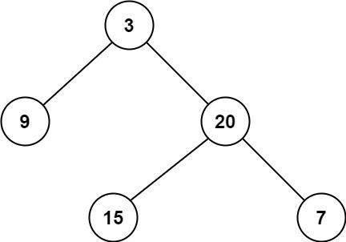

## 题目描述

原题地址：[二叉树的最小深度](https://leetcode-cn.com/problems/minimum-depth-of-binary-tree/)

难度：简单

给定一个二叉树，找出其最小深度。

最小深度是从根节点到最近叶子节点的最短路径上的节点数量。

说明：叶子节点是指没有子节点的节点。

示例 1：

```
输入：root = [3,9,20,null,null,15,7]
输出：2
```
示例 2：
```
输入：root = [2,null,3,null,4,null,5,null,6]
输出：5
```

提示：
- 树中节点数的范围在 [0, 10^5] 内
- -1000 <= Node.val <= 1000

## 题解
### 题解1 bfs
#### 1. 解题思路
1. 求最小深度，考虑使用广度优先遍历
2. 在广度优先遍历过程中，遇到叶子节点，停止遍历，返回节点层级

解题步骤：
1. 广度优先遍历整棵树，并记录每个节点的层级
2. 遇到叶子节点，返回节点层级，停止遍历

#### 2. 代码实现
```js
var minDepth = function(root) {
    if(!root) { return 0; }
    const q = [[root, 1]];
    while(q.length) {
        const [n, l] = q.shift()
        if(!n.left && !n.right) {
            return l
        }
        if(n.left) q.push([n.left, l + 1])
        if(n.right) q.push([n.right, l + 1])
    }
};
```

#### 3. 复杂度分析
时间复杂度O(n), 空间复杂度O(n)

### 题解2 深度优先遍历
#### 代码实现
```js
var minDepth = function(root) {
    if(root == null) {
        return 0;
    }
    if(root.left == null && root.right == null) {
        return 1;
    }
    let ans = Number.MAX_SAFE_INTEGER;
    if(root.left != null) {
        ans = Math.min(minDepth(root.left), ans);
    }
    if(root.right != null) {
        ans = Math.min(minDepth(root.right), ans);
    }
    return ans + 1;
};
```

## 高赞题解
[画解算法：111. 二叉树的最小深度](https://leetcode-cn.com/problems/minimum-depth-of-binary-tree/solution/hua-jie-suan-fa-111-er-cha-shu-de-zui-xiao-shen-du/)  
[官方题解](https://leetcode-cn.com/problems/minimum-depth-of-binary-tree/solution/er-cha-shu-de-zui-xiao-shen-du-by-leetcode-solutio/)  